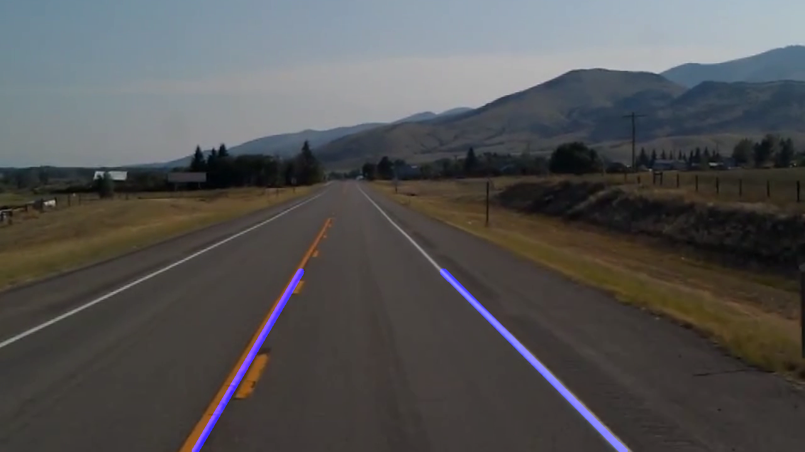

<h1># Lane-Detection 1.0</h1>

<h2>Detect Lane in photo and video</h2>

This project is a small model of how a self-driven car move on road by detecting lanes with the help of Computer Vision

Still required to include many more things to complete this project

Test Video cannot be uploaded as it's size is more than 25 MB
Though you can run on any video having lanes

Sample Images:

